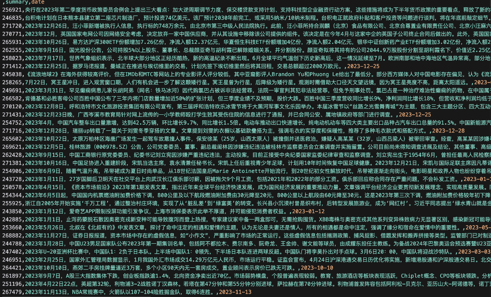
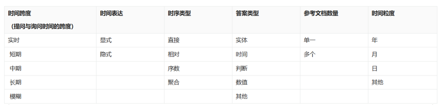

# 📕LLM小组自建数据集指南

## 目录

- [📕LLM小组自建数据集指南](#llm小组自建数据集指南)
  - [目录](#目录)
  - [项目介绍](#项目介绍)
  - [自建数据集通用流程](#自建数据集通用流程)
    - [1. 数据集格式需求确认](#1-数据集格式需求确认)
    - [2. 数据收集](#2-数据收集)
    - [3. 数据清洗与预处理](#3-数据清洗与预处理)
    - [4. 数据标注](#4-数据标注)
    - [5. 数据增强（可选）](#5-数据增强可选)
    - [6. 数据划分与存储](#6-数据划分与存储)
    - [7. 质量评估（必须）](#7-质量评估必须)
    - [8. 数据集发布与维护](#8-数据集发布与维护)
  - [案例分析1：ChronoQA 数据集](#案例分析1chronoqa-数据集)
    - [1. 数据源获取](#1-数据源获取)
    - [2. 数据预处理](#2-数据预处理)
    - [3. 问题生成与验证](#3-问题生成与验证)
    - [4. 数据集质量控制](#4-数据集质量控制)
    - [5. 结果存储](#5-结果存储)
  - [案例分析2：多模态虚假新闻检测数据集AMG构建](#案例分析2多模态虚假新闻检测数据集amg构建)
    - [1. 数据源获取](#1-数据源获取-1)
    - [2. 数据处理与标注](#2-数据处理与标注)
      - [2.1 数据过滤](#21-数据过滤)
      - [2.2 专家标注](#22-专家标注)
      - [2.3 归因类型](#23-归因类型)
      - [2.4 特殊情况](#24-特殊情况)
      - [2.5 交叉验证与讨论](#25-交叉验证与讨论)
    - [3. 数据整合与分析](#3-数据整合与分析)
      - [3.1 数据整合](#31-数据整合)
      - [3.2 数据集划分](#32-数据集划分)
      - [3.3 归因规则合理性](#33-归因规则合理性)
    - [4. 法律与伦理](#4-法律与伦理)
    - [5. 结论](#5-结论)


---

## 项目介绍

数据集是模型训练的基础。然而，针对特定任务或领域，可能缺乏直接可用的数据集，因此需要自建数据集。本指南提供了一个系统化的流程，帮助大家从零开始构建高质量的数据集。

---

## 自建数据集通用流程

### 1. 数据集格式需求确认

在收集数据之前，首先需要确认数据集的格式需求，包括：

- **数据格式**：常见格式如 `JSON`、`CSV`、`Parquet`，根据任务需求选择合适的格式。
- **字段要求**：
  - 结构化数据：每条数据需要包含哪些字段？
  - 非结构化数据：如文本、图像、音频，是否需要额外的元数据？
- **存储方式**：
  - 是否存储在本地文件系统、数据库（如 MongoDB）、对象存储（如 S3）、或开源平台（如 Hugging Face）？
- **数据规模**：
  - 需要多少样本？如何保证数据的代表性？
- **使用场景**：
  - 是否用于训练、验证、测试？是否需要对数据进行版本控制？
- **数据隐私与合规性**：
  - 是否涉及敏感数据？是否需要去除个人身份信息（PII）？

在明确这些问题后，再进入下一步的数据收集。

---

### 2. 数据收集

数据收集是数据集构建的第一步，可采用以下几种方式：

- **公开数据集**：如 [Hugging Face Datasets](https://huggingface.co/datasets)、[Kaggle](https://www.kaggle.com/datasets)。
- **爬虫抓取**：从合法渠道获取数据，如新闻、社交媒体等（注意合规性）。
- **人工生成**：设计数据样本，适用于低资源任务。
- **LLM 生成**：使用 LLM 生成数据。
- **数据购买**：如果项目预算允许，可以申请购买第三方数据。

---

### 3. 数据清洗与预处理

- 统一数据格式（如 `.csv`、`.json`）。
- 去除无效样本（如乱码、重复数据）。
- 数据脱敏（如去除个人信息）。
- 规范化文本/图像/视频等数据（如分词、去除停用词、去噪）。
- 处理缺失值（插值、删除、填充）。

---

### 4. 数据标注

- **人工标注**：使用标注工具或者众包标注。
- **自动标注**：通过 LLM 或者其他模型进行自动化标注数据。
- **数据验证**：对于自动标注，需要人工验证可靠性。

---

### 5. 数据增强（可选）

- **文本数据**：同义词替换、回译（翻译再翻回）、文本拼接。
- **图像数据**：旋转、翻转、调整亮度、添加噪声。
- **语音数据**：音调变化、速度变化、背景噪音。

---

### 6. 数据划分与存储

- **划分比例**：通常按 80% 训练集，10% 验证集，10% 测试集。
- **存储格式**：`JSON`、`CSV`、`Parquet`、数据库等。

---

### 7. 质量评估（必须）

- **数据完整性检查**（是否有缺失值、格式错误）。
- **数据分布检查**（类别是否均衡）。
- **标注质量评估**（计算一致性指标，如 F1-score）。

---

### 8. 数据集发布与维护

- 通过 GitHub 或 Hugging Face 发布数据集，并定期更新数据集。
- 记录数据版本变更日志。
- 允许用户反馈数据错误并修正。

---

## 案例分析1：ChronoQA 数据集

本部分以 ChronoQA 数据集为案例，介绍一个完整的时间敏感型 QA 数据集构建流程。

### 1. 数据源获取

ChronoQA 主要关注 **时间敏感型问题**，因此数据主要来自 **新闻**。其数据来源如下：

- **新闻文章收集**：使用爬虫抓取 2019-2024 年的新闻数据。
- **数据清洗**：去除重复、格式转换、时间标准化。

---

### 2. 数据预处理

- 选取具有时间信息的新闻段落，使用 LLM 生成简要的时间描述。
- 过滤掉没有明确时间标注的内容，确保数据的时间敏感性。



---

### 3. 问题生成与验证

ChronoQA 采用以下流程构造问题集，结合了规则和LLM生成的方式：

- **单一时间问题生成**：撰写Prompt以及示例样本，让大模型依据具体段落生成单跳 QA 对，包括QA的对应label（自己拟定的类别等标签信息）。

- **多步推理问题构造**：结合规则和大模型，生成多跳QA对
  - **串联问题（series circuit）**：问题 1 依赖于问题 2 的答案。
  - **并联问题（parallel circuit）**：多个独立 QA 组合成更复杂的查询。
- **人工和自动化检查**：
  - 规则过滤（如时间冲突检测）。
  - LLM 评估问题质量。
  - 人工审核样本（确保 QA 质量）。

---

### 4. 数据集质量控制

- **多级过滤**：去除无效、低质量 QA 对。
- **统计分析**：
  - 时间范围覆盖：确保涵盖长短期时间推理任务。
  - 类别均衡性检查：避免过度偏向某些类别。

---

### 5. 结果存储

ChronoQA 数据最终以 **JSON 格式** 存储，包含以下字段：
```json
{
    "question":"2024年苹果计划的新款iPhone的目标出货量是多少？",
    "question_date":"2024-08-30",
    "answer":"至少9000万部",
    "temporal_expression_type":"implicit",
    "temporal_scope":"mid-term",
    "temporal_granularity":"year",
    "temporal_type":"absolute",
    "answer_type":"numerical",
    "reference_document_count":"single",
    "ref_prompt":"single_direct_expression",
    "reference_qa_list":null,
    "original_question":null,
    "event_name":null,
    "event_time":null,
    "golden_chunks":[
        "苹果计划在2024年新款iPhone出货量增长10%，目标出货量至少9000万部，预计这些目标将帮助公司在经历2023年困难后实现翻身。"
    ]
}
```
## 案例分析2：多模态虚假新闻检测数据集AMG构建

本部分以AMG数据集为案例，介绍一个完整的多模态虚假新闻检测与归因数据集构建流程。

### 1. 数据源获取

AMG 数据集主要用于多模态虚假新闻检测与归因，因此其数据主要来自 **社交平台** 和 **事实核查网站**。数据源如下：

- **虚假新闻收集**：
  - 使用爬虫抓取来自 Snopes 和 CHECKYOURFACT 等事实核查网站的虚假新闻。这些网站提供了关于新闻真实性的判定文章，用于更精细的标签分类。
  - 通过抓取社交平台（如 Instagram、Facebook、Twitter、TikTok 和 YouTube）上的原始帖子进行收集。重点抓取 Instagram、Facebook 和 Twitter 的内容。
  
- **真实新闻收集**：
  - 起初从事实核查网站抓取经过验证的真实新闻，但数量较为有限（仅有 126 条）。
  - 为了缓解真实新闻与虚假新闻之间的固有偏差，进一步从权威中立媒体（如 Reuters 和 NewsNation）获取与虚假新闻相关的真实新闻。
  - 由于真实新闻数量不足，从这些媒体账户的存档中随机选择一定数量的新闻，新闻时间范围为 2016 至 2024 年。

---

### 2. 数据处理与标注

#### 2.1 数据过滤
- 过滤新闻文章，确保包含多模态新闻内容（如图像和视频）。通过视觉内容相似度筛选，去除高相似度的新闻文章，确保数据的多样性。

#### 2.2 专家标注
- 标注工作由 17 位专家团队进行，确保标注的一致性与准确性。专家们根据详细的标注指南和专门的培训，执行虚假新闻的归因流程。

#### 2.3 归因类型
- **图像伪造（ImageFab）**：图像真实性存在问题，包括深度伪造（Deepfake）和图像拼接等。
- **无效图像（ImageNoE）**：图像仅包含文本信息，无法为新闻内容提供证据或支持，常见于虚假新闻。
- **实体不一致（EntityInc）**：文本与图像中的主要实体不一致，即实体描述不匹配。
- **事件不一致（EventInc）**：尽管文本和图像包含相关实体，但描述的事件存在不一致，图像本身没有伪造，但文字描述可能误导。
- **时间不一致（TimeInc）**：图像或视频未修改，但错误地用来表示近期事件，如使用过去的灾难或集会照片误导公众。

#### 2.4 特殊情况
- 如果某些实例不符合上述任何类别，则标记为“无上述情况”。

#### 2.5 交叉验证与讨论
- 每条虚假新闻会由三位标注员进行标注，最终归因通过多数投票决定。对于有争议的案例，进行二轮标注和讨论。

---

### 3. 数据整合与分析

#### 3.1 数据整合
- 去除不符合归因类型的虚假新闻，最终数据集包含 2004 条虚假新闻和 3018 条真实新闻。虚假新闻归因类型包括图像伪造、事件不一致、时间不一致等。

#### 3.2 数据集划分
- 数据集被划分为训练集（3532 条）、验证集（517 条）和测试集（973 条），比例为 7:1:2，确保每个子类别的比例一致。

#### 3.3 归因规则合理性
- 通过统计分析，约 3% 的样本不符合预定义的归因类别，表明归因规则能够有效覆盖几乎所有虚假新闻。

---

### 4. 法律与伦理

- **数据抓取合规性**：严格遵守每个平台的数据抓取规则，确保所有数据的收集符合版权和隐私要求。
- **数据隐私保护**：在标注过程中，仅选择与公共人物或事件相关的帖子，避免涉及普通用户。所有个人信息均进行匿名化处理。
- **数据存储安全性**：所有收集的数据存储在安全服务器上，研究团队成员具有限制访问权限。

---

### 5. 结论

通过上述步骤，我们构建了 AMG 数据集，该数据集用于多模态虚假新闻检测，涵盖了来自多个平台的虚假新闻，并通过详尽的标注过程确保其多样性与准确性。此数据集为未来的虚假新闻检测与归因研究提供了有力支持。
